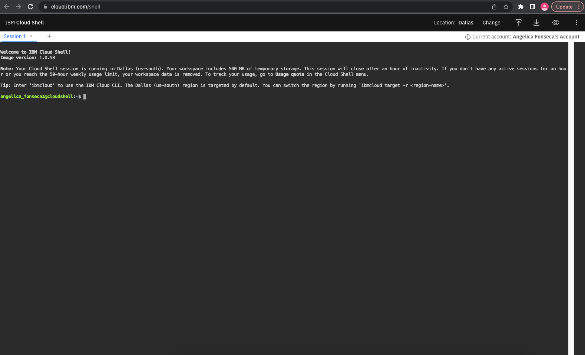

# Project Week 7: Deploying to-do list front-end microservice on a cloud cluster

## Introduction
As of now, you have completed Project Week 6 and should now have an understanding of the regular development of a fully functional to-do-list Application. For Project Week 7, you will go through the process of understanding containerizing the microservice and the process of deploying the to-do-list front-end microservice component on an IBM cloud cluster.


## Containerizing microservice
- Developing in microservices is the art of breaking down the old model of building one large application, i.e., a "monolithic" application, and forming a new model where specialized, cloud-hosted sub applications—each charged with a very specific task—work together. For this, we have added a `frontendserver.js` using express.
- Containers are a standard way to package an application and all its dependencies so that it can be moved between environments and run without change. Docker is one of the most popular Containerization platforms, which allows you to develop, deploy, and run the application inside containers. We have created a Dockerfile to containerize the to-do-list front-end application. **Note**: Below commands are just for your understanding.
- We have then built the docker image and tagged it using the below command.
```
docker build -f Dockerfile -t ibmaccelerate/cloudnative:frontend_v1 .
```
- The Image is pushed to the docker hub. You will be using this already built image to deploy on your cluster.


## Prerequisites
+ Create IBM cloud ID using the instructions and IBM Cloud Feature Code shared via email or using the information [here](https://github.com/academic-initiative/documentation/tree/main/academic-initiative/how-to/How-to-create-an-IBM-Cloud-account).
+ **Optional:** The below steps are required only if you would like to deploy the application from your local terminal.
  - Install `kubectl` on your machine using instructions [**here**](https://kubectl.docs.kubernetes.io/installation/kubectl/).
  - If you would like to run the install instructions from your local machine terminal window, you would need to install `IBM cloud CLI` using Steps 1 to step 3 instructions [**here**](https://cloud.ibm.com/docs/containers?topic=containers-cs_cli_install).


## Instructions

### Deploy and configure Kubernetes service cluster from IBM Cloud Catalog

1. Log in to [cloud.ibm.com](https://cloud.ibm.com) using your IBM cloud ID.

2. Go to the IBM Cloud **Catalog**, which can be accessed by clicking the **Catalog** button beside the search bar in the global header. Search for the Kubernetes service.


3. Deploy Kubernetes Service by providing cluster name and selecting the free plan to create a Kubernetes cluster. Once the information is provided, click on the **Create** located at the bottom right side of your screen.


4. Wait for the Deployment to finalize and for the cluster to be created.

**Note:** If you would like to access the cluster anytime later, you can access it by going to the left hamburger menu --> Resource List --> Select your cluster name under clusters.


5. Once the Deployment is complete and the cluster is ready, open the IBM Cloud **Shell** located at the top right in the global header.


A new tab should open. Leave it open since we will use it in the next steps.



6. Go back to your cluster page. Click on the **Actions** drop-down menu and select **Connect via CLI**.


7. You can run the `connect via CLI` instructions in your `IBM cloud shell`, which you have opened earlier, or, optionally, from your terminal window. **Note:** If you are going to run the instructions from the terminal window, then you would need the `ibmcloud` and `kubectl` CLIs installed on your machine, as mentioned optional in the `Prerequisites` section of this document.


### Deploy the to-do list application (front-end) microservice of Kubernetes cluster

#### Deploy the application from `IBM Cloud Shell` of your deployed Kubernetes cluster.
At this point, it is assumed that you have a terminal window opened and that you are connected to the clusters (steps in the previous section)/

1. Clone the to-do-list week 7 project using your IBM Cloud **Shell**. **Note** You would need to pass GitHub personal access token as the password when prompted.

   ```
   git clone <your-to-do-list-project-URL>
   ```
  Go to your project directory:
   ```
   cd to-do-list_week7-<your-username>
   ```

  If you are able to successfully clone the to-do-list project, jump to step 2 to deploy the application. If you have issues cloning the GitHub project, follow the below steps on your IBM Cloud **Shell** to create the deployment templates.

  - Create a folder for Deployment manifests:
    ```
    mkdir deployment-templates
    ```

  - Create the to-do list Deployment and Service templates inside the above-created folder with the below steps.
    - Create todolist-deployment.yaml and copy the contents from the project and save.

    ```
    cat << "EOF" > deployment-templates/todolist-deployment.yaml
    apiVersion: apps/v1
    kind: Deployment
    metadata:
      name: to-do-list
      labels:
        app: to-do-list
    spec:
      selector:
        matchLabels:
          app: to-do-list
      replicas: 1
      template:
        metadata:
          labels:
            app: to-do-list
        spec:
          containers:
          - name: to-do-list
            image: ibmaccelerate/cloudnative:frontend_v1
            imagePullPolicy: Always
            ports:
            - containerPort: 8080
              name: https
              protocol: TCP
    EOF
    ```
    - Create todolist-service.yaml and copy the contents from project and save.

    ```
    cat << "EOF" > deployment-templates/todolist-service.yaml
    apiVersion: v1
    kind: Service
    metadata:
      name: todolist-service
    spec:
      type: NodePort
      # Each Pod in the Deployment that you created previously has the below label. So the Pods in the Deployment will become members of this Service.
      selector:
        app: to-do-list
      ports:
          # By default and for convenience, the `targetPort` is set to the same value as the `port` field.
        - port: 8080
          targetPort: 8080
          # Optional field
          # By default and for convenience, the Kubernetes control plane will allocate a port from a range (default: 30000-32767)
          nodePort: 30007
    EOF
    ```
  **Note** : Frontend deployment image `ibmaccelerate/cloudnative:frontend_v1` can be found in the `todolist-deployment.yaml` file.

2. Deploy the to-do-list front-end application on your cluster using `kubectl` on your **IBM Cloud Shell**.

   - Create the Deployment. Execute the below command from `deployment-templates` directory.
     ```
     cd deployment-templates
     ```
     ```
     kubectl apply -f todolist-deployment.yaml
     ```

   - Validate if the Deployment is running with the below commands.

     ```
     kubectl get deployments
     ```
     The output will look something like the below example. **Note:** If the status shows as Ready 0/1, it may take a few min for the status to go to Ready 1/1. You can rerun the command after a few minutes to check the status.
     ```
     NAME         READY   UP-TO-DATE   AVAILABLE   AGE
     to-do-list   1/1     1            1           31m
     ```

     ```
     kubectl get pods
     ```
     The output will look something like the below example. **Note:** If the status shows as `ContainerCreating`, it may take a few min for the status to become running. You can rerun the command after a few minutes to check the status.

     ```
     NAME                          READY   STATUS    RESTARTS   AGE
     to-do-list-786468885b-bl5p5   1/1     Running   0          30m
     ```

  - Create and expose the Service. Execute the below command from `deployment-templates` directory.
     ```
     kubectl apply -f todolist-service.yaml
     ```

  - Validate the service creation.
    ```
    kubectl get service
    ```
    The output will look something like the below example:
    ```
    NAME               TYPE           CLUSTER-IP      EXTERNAL-IP   PORT(S)          AGE
    todolist-service   NodePort       172.21.4.185    <none>        8080:30007/TCP   14s
    ```
 **Note:** The above commands can also be executed from your local terminal window.


### Access your to-do list front-end application

Upon completion of the Deployment of the to-do list front-end application on your IBM Cloud Kubernetes cluster, access the application on your browser using the below steps.

1. Get the `EXTERNAL-IP` of your node using the below command
  ```
  kubectl get nodes --output wide
  ```

The output will look something like the below.
  ```
  NAME            STATUS   ROLES    AGE    VERSION       INTERNAL-IP     EXTERNAL-IP      OS-IMAGE             KERNEL-VERSION       CONTAINER-RUNTIME
  10.144.213.61   Ready    <none>   3d1h   v1.23.8+IKS   10.144.213.61   169.51.203.132   Ubuntu 18.04.6 LTS   4.15.0-189-generic   containerd://1.6.6
  ```

2. Access your application on a browser. Replace the `<EXTERNAL-IP>`
  ```
  http://<EXTERNAL-IP>:30007
  ```

Example:
  ```
  http://169.51.203.132:30007
  ```

3. You should be able to access the application using your preferred browser:


## Pre-session material

1. Cloud-Native
   - [Overview](https://cloudnative101.dev/concepts/cloud-native/)
   - [Application Development](https://cloudnative101.dev/concepts/cloud-native-app-dev/)
2. Containers
   - [Concepts](https://cloudnative101.dev/concepts/containers/)
3. [What is Kubernetes?](https://cloudnative101.dev/concepts/kubernetes/)
4. Kubernetes
   - [Concepts](https://kubernetes.io/docs/concepts/)
